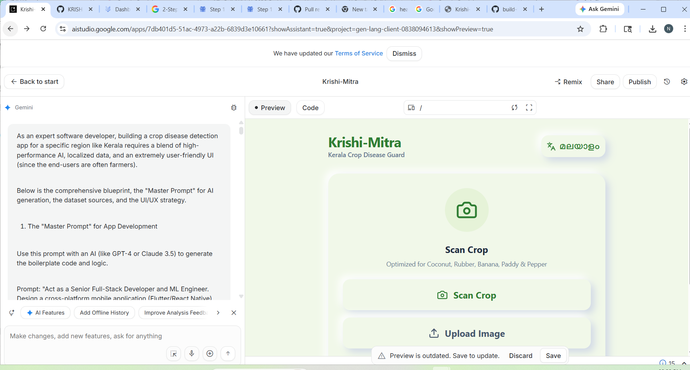
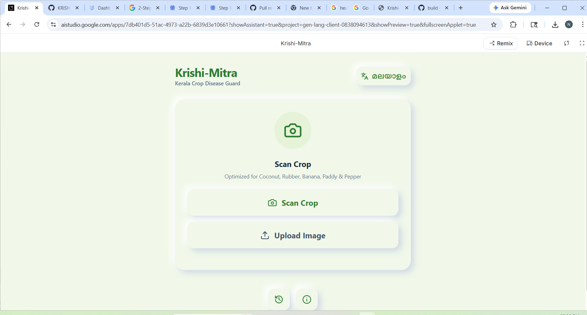
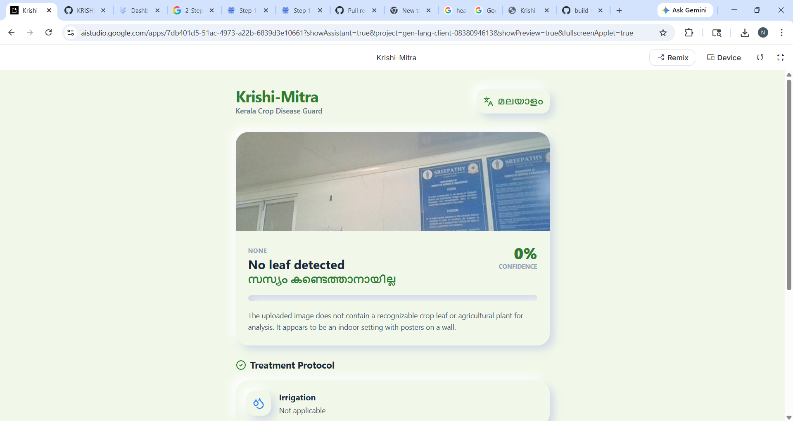
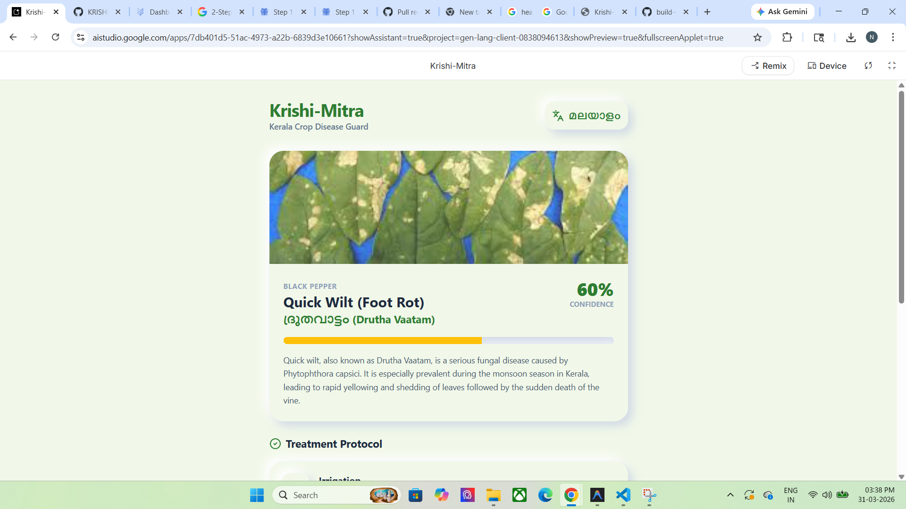

# Krishi-Mitra (കൃഷി-മിത്ര) 🌿

## Problem Statement
Farmers in Kerala face significant crop losses due to localized diseases like Coconut Root Wilt, Rice Blast, and Banana Bunchy Top. Traditional diagnosis is slow, often requiring expert visits to remote farms. Furthermore, technical agricultural advice is frequently unavailable in the local language (Malayalam), creating a barrier for effective disease management.

## Project Description
**Krishi-Mitra**, developed by **Team InnoveX**, is an AI-powered real-time crop disease detection application with **Offline Inference** support. It allows farmers to instantly diagnose diseases by scanning a leaf with their camera or uploading a photo, even without an internet connection. The app provides:
- **Instant Diagnosis**: Identification of diseases specific to Kerala's major crops.
- **Localized Advice**: Treatment protocols (Irrigation, Pesticide, Pruning) provided in both English and Malayalam.
- **User-Centric Design**: A high-contrast, neumorphic UI with large icons, optimized for field use by farmers.
- **Confidence Scoring**: Transparent AI certainty levels to help farmers make informed decisions.

---

## Google AI Usage
### Tools / Models Used
- **Google Gemini 3 Flash** (`gemini-3-flash-preview`): Used for high-speed, multimodal image analysis.
- **Google Generative AI SDK** (`@google/genai`): For seamless integration of LLM capabilities into the React frontend.

### How Google AI Was Used
Gemini 3 Flash serves as the "Expert Pathologist" within the app. When a farmer captures an image, the app sends the image along with a specialized prompt to Gemini. The AI:
1. **Identifies the Crop**: Recognizes if it's Coconut, Paddy, Banana, Rubber, or Pepper.
2. **Diagnoses the Disease**: Detects visual symptoms of localized diseases.
3. **Generates Structured Data**: Returns a JSON object containing the disease name, its Malayalam equivalent, a confidence score, and a three-part treatment protocol.
4. **Localizes Content**: Translates complex agricultural advice into clear, actionable Malayalam script.

---

## Proof of Google AI Usage
Attach screenshots in a `/proof` folder:



---

## Screenshots 
Add project screenshots:

  



---

## Demo Video
Upload your demo video to Google Drive and paste the shareable link here(max 3 minutes).
[Watch Demo](https://drive.google.com/file/d/1rk_alAF85eBUdqXjGFCSLY_Z1qlBoww6/view?usp=sharing)

---

## Installation Steps

```bash
# Clone the repository
git clone <your-repo-link>

# Go to project folder
cd krishi-mitra

# Install dependencies
npm install

# Run the project
npm run dev
```

---
**Developed by Team InnoveX**
